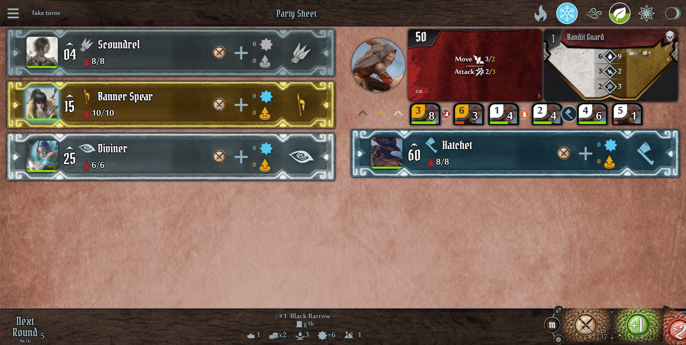

# Gloomhaven Secretariat

## [Latest Online Version](https://gloomhaven-secretariat.de)

[](https://github.com/Lurkars/gloomhavensecretariat/actions/workflows/latest.yml) [](https://github.com/Lurkars/gloomhavensecretariat/actions/workflows/release.yml) [](https://github.com/Lurkars/gloomhavensecretariat/actions/workflows/publish-docker-image.yml)



> Scenario 1 of Gloomhaven with starting classes of different editions

## Introduction

*Gloomhaven Secretariat* is a **companion app** for Gloomhaven-based board games. The app supports all official editions, namely **Gloomhaven**, **Frosthaven**, **Jaws of the Lion**, **Forgotten Circles** and **Button & Bugs**, the community editions **The Crimson Scales** and **Trail of Ashes** as well as **Solo** scenarios and custom content.

*GHS* is a complete replacement for the abandoned [Gloomhaven Helper](http://esotericsoftware.com/gloomhaven-helper) app (by [Esoteric Software®](http://esotericsoftware.com)), enhanced with more tracking and automation features. As a single-screen web application, *GHS* helps manage scenario play by tracking character and monster turns, automatically setting up monsters separately for each room or section, assisting with scenario-specific rules, attack modifiers, loot deck, and much more. *GHS* also tracks your progress on the Character, Party and Campaign sheets, allowing you to buy and equip items, loot treasures, apply all scenario rewards, register scenario unlocks and manage your outpost. For a more detailed feature list, including a comparison of some popular applications, see [Comparison of Companion Apps](./resources/app-comparison.md).

Multiple clients are supported by a server component [Gloomhaven Secretariat Server](https://github.com/Lurkars/ghs-server) with a public instance available at `gloomhaven-secretariat.de`.

Since *GHS* is a web application, no installation is required and it runs in any modern browser, even on mobile devices, but it can also be [installed](#install) for offline use.

An extensive settings menu ensures highly individual customization to suit all requirements. Almost every feature can be switched on/off or customized.

*Gloomhaven Secretariat* is open-source software built with [Angular](https://angular.io/) and is open for the community to actively [contribute](#contributing) ideas, suggestions and of course feedback and bug fixes. You can also help [translating](#translating) the app.

A basic user guide is available [online](https://help.gloomhaven-secretariat.de).

> SPOILER WARNING:
> The `label/spoiler` folder in the `data` folders, and therefore the final edition data files in the releases in the `./assets/data` folder, contain spoilers by including the appropriate label. 
> 
> [More information about spoilers in this repository](https://github.com/Lurkars/gloomhavensecretariat/discussions/103)

## Support me

☕ [Buy me a coffee?](https://ko-fi.com/lurkars) (or [Donate directly via PayPal](https://paypal.me/Lurkars))

## Current Features

- Base feature complete for GH, FH, JOTL, FC and CS (all need testing, so please [contribute](#contributing)!), for details see [Data Progression](./resources/data-progression.md)
- Tracking:
  - **Initiative** sorting
  - **Health** automatic exhaust/dead, max values for each level
  - **Conditions** auto expire + auto apply (wound, wound_x, regen, bane, poison, poison_x, ward, brittle)
  - **Level**, **Loot**, **Experience** of characters
  - **Character Progression** level, loot, experience, items, battle goals, perks, masteries
  - **Character Attack Modifier Deck** including Perks & CS Oak Cards
  - **Elements** automatic update status
  - **Monster Stats**
  - **Monster Standees** automatically adds standees for scenario rooms/sections, special rules and random monster cards
  - **Monster Modifier Deck** Adding **Blessings** and **Curses**, auto-shuffling
  - **Monster Ability Cards** auto-shuffling, calculated values (separate for normal and elite), add stats values
  - **Character Summons**
  - **Scenarios** and **Sections** with automatic level calculation, displays and applies special rules, and applies scenario results to character progression
  - **Party Sheet**
  - **Campaign Management** (some special rules for CS are missing)
  - **Markers**
  - **Treasures**
  - **Character Items** (must be enabled in Settings!) manage state of items during a scenario 
  - **Battle Goals** (must be enabled in Settings!)
- Elimination of the following physical components
  - Monster ability cards
  - Monster stat cards
  - Monster attack modifier deck
  - Damage tokens
  - Condition tokens
  - Element board, elemental disc, round tracker, initiative trackers
  - Character HP/XP dials
  - Character boards
  - Character sheets
  - Character attack modifier deck
  - Loot deck
  - Town guard deck
  - Party/Campaign sheet
  - Item Cards
  - Battle Goals
  - Building deck (partly!)
  - Frosthaven Decks:
    <details>
      <summary>SPOILER WARNING: Building 81</summary>

      > Trials Deck
    </details>
    <details>
      <summary>SPOILER WARNING: Building 90</summary>

      > Challenges Deck
    </details>
  - World Map
- Other features:
  - i18n support (currently en, de, fr and ko, more translations needed. Many thanks to the contributors of french and korean)
  - PWA for installation on all devices!
  - Synchronise state (+ settings) with [GHS Server](https://github.com/Lurkars/ghs-server)
  - Manage permissions for different clients with [GHS Server](https://github.com/Lurkars/ghs-server)
  - [Keyboard Shortcuts](./resources/keyboard-shortcuts.md)
  - Load custom JSON edition data for custom content!
  - Edit monster attack modifier and monster ability decks (support for Diviner class mechanics): reveal cards, remove cards, rearrange cards
  - Support for Frosthaven loot deck (including enhancements) and town guard deck
  - Support for Frosthaven Building 81 and 90 Mechanics including automation (if possible)
  - special ability automation for some characters
    <details>
      <summary>SPOILER WARNING: </summary>

      > Automatically add/remove time tokens at start of round after defining slow/fast before
    </details>
    <details>
      <summary>SPOILER WARNING: </summary>

      > Unholy Prowess: Add +1 Heal to to all Shambling Skeletons

      > Solid Bones: Add +1 HP, +1 Move and Pierce 1 to all Shambling Skeletons
    </details>
    <details>
      <summary>SPOILER WARNING: </summary>

      > One with the Mountain: Whenever not having Regenerate, gain Regenerate

      > Gift of the Mountain: Heal 2 self at end of each turn
    </details>
    <details>
      <summary>SPOILER WARNING: </summary>

      > Perk 11: Start each scenario with 2 Trophy Tokens
    </details>
    <details>
      <summary>SPOILER WARNING: </summary>

      > Toggle Mode Token for summons (inactive if Mode Token set)

      > Repair Drone Mode: Heal 2 self at start of turn
    </details>
    <details>
      <summary>SPOILER WARNING: </summary>

      > Resonance Tokens: At the end of each of your turns, you gain one Resonance Token

      > Perk 10: Start scenario with Brittle to gain 2 Resonance Tokens
    </details>
    <details>
      <summary>SPOILER WARNING: </summary>

      > Perk 9: Muddle new revealed Monster
    </details>
    <details>
      <summary>SPOILER WARNING: </summary>

      > Mech Suit (+5 HP, Heal 10)
    </details>
    <details>
      <summary>SPOILER WARNING: </summary>

      > Blood Pact: Summer 1 damage at the start of each of your turns 

      > Unbridled Power: Enable overhealing up to 26 HP
      
      > Careless Charge: Toggle immunity for all conditions
    </details>
    <details>
      <summary>SPOILER WARNING: </summary>

      > Automatically gain 1 XP at start of turn for active song
    </details>
  - Random Dungeons
  - Scenario Flow Chart
  - Scenario Stats (damage/heal provided and received)
  - Monster data editor (https://gloomhaven-secretariat.de/editor/monster)
  - Includes Solo scenarios
  - Includes the [Seeker of Xorn](https://boardgamegeek.com/thread/2220121/seeker-xorn-bonus-content) campaign: can be enabled under *Data Management*.
  - Includes the [Satire's Extended Battle Goals](https://boardgamegeek.com/thread/2184131/satires-extended-battle-goals): can be enabled under *Data Management*.
  - Includes [Ice Rift](https://boardgamegeek.com/thread/2341619/custom-campaign-ice-rift): can be enabled under *Data Management*.
  - Includes [Blood and Sand](https://boardgamegeek.com/thread/2613617/blood-and-sand-gloomhaven-campaign-set-red-desert) campaign: can be enabled in *Data Management* (Thanks to [/u/Calm_Construction131](https://www.reddit.com/user/Calm_Construction131) for contribution)
  - Manage multiple campaigns
  - Show errata hints (must be enabled in Settings)
  - <details>
      <summary>SPOILER WARNING: Envelope X (and V)</summary>

      > To add Envelope X (or V for ToA), enable it under *Data Management*, then enter the full name in the *Character Filter* (not case sensitive).
    </details>

### Planned next

- Support for event cards (draw, manage, apply rewards)

### Long term plans

- Support for managing character ability cards

## Install

### Install as App

You can always install any hosted version as an App (PWA) if your OS/Browser supports PWA installation. For example, here is the [Latest Online Version](https://gloomhaven-secretariat.de).

Instructions for different devices/browsers:
- [Chrome: Computer/Android](https://support.google.com/chrome/answer/9658361)
- [Safari: iOS](https://developer.mozilla.org/en-US/docs/Web/Progressive_web_apps/Installing#safari_for_ios_iphoneos_ipados)
- [Firefox: Android](https://developer.mozilla.org/en-US/docs/Web/Progressive_web_apps/Installing#firefox_for_android)
- other: search for "install PWA"

### Standalone

An Electron application is available for Linux, Mac and Windows.
Download the appropriate files from the [latest release](https://github.com/Lurkars/gloomhavensecretariat/releases/latest) assets.

> Linux AppImage only tested for now

### Self-hosting

To self-host *Gloomhaven Secretariat* on your web server, simply download the zip file from the [latest release](https://github.com/Lurkars/gloomhavensecretariat/releases/latest) and unzip it on your web server.

> The base url for this build is set to root. To use a different base URL, please [build your own package](#build-from-source).

#### Build and run with Docker

[](https://github.com/Lurkars/gloomhavensecretariat/actions/workflows/publish-docker-image.yml)

If you want to use docker to run on port 80, run the following

```shell
docker pull gloomhavensecretariat/ghs
docker run --rm -p 80:80 --name ghs gloomhavensecretariat/ghs
```

For use with docker compose, just run `docker compose up -d`.

## Building from source

If you want to create your own custom build (e.g. for [self-hosting](#Selfhosting)), prepare a [development setup](#development). Then run `npm run build` ([available options](https://angular.io/cli/build#options)) and access the build at `./dist/gloomhavensecretariat`.

## Development

Prerequisite:

- Current [Node.js](https://nodejs.org) and npm version

Check out the source with `git clone https://github.com/Lurkars/gloomhavensecretariat.git`.

Install the dependencies with `npm install`.

Then run `npm run start` to create a development server at [http://localhost:4200](http://localhost:4200).

To develop with docker, install docker compose and run `docker compose -f docker-compose.dev.yaml up -d`.

## Contributing

Feel free to file a [new issue](https://github.com/Lurkars/gloomhavensecretariat/issues/new/choose) for bugs, features, and improvements, or start a new [new discussion](https://github.com/Lurkars/gloomhavensecretariat/discussions/new/choose) for help or feedback.

All game data is located in the [data](./data/) folder with subfolders for each release. A third-party review of all data would be great. As all files are JSON data, they should easily be human-readable. Each character, monster, and monster deck has its own file, so it should be easy to check.
Each edition folder will be concatenated into a single edition data file on build.

Pull requests are also welcome!

> Please note: all files in the data subfolder will be automatically formatted and added to each commit. If you have made local changes to these files and do NOT want to commit those changes, please use the `--no-verify` parameter for your `git commit` and `git push` commands.

Thanks to everyone who has already [contributed](https://github.com/Lurkars/gloomhavensecretariat/graphs/contributors), you're awesome!

### Translating

Latest, I am now trying to use [Weblate](https://translate.gloomhaven-secretariat.de/) as a translation tool. You can log in with your *GitHub* account to help translate the application.


## Archive

All older versions are also available on `gloomhaven-secretariat.de`, for example the first version `v0.0.1` is available at [v0-0-1.gloomhaven-secretariat.de](https://v0-0-1.gloomhaven-secretariat.de). All available tags are listed under [Releases](https://github.com/Lurkars/gloomhavensecretariat/releases), just replace all `.` with `-` for a proper url. This is meant as a showcase for the evolution of GHS, but also as a fallback, if a release breaks something important, you can always fall back to a previous version. 

> Please note that there is no history of the server component. So connecting to the current server with older clients may not work properly!

## Privacy

This application does NOT collect any personal data. Everything runs and stays in your browser/local memory. For details on the server component please go to [Gloomhaven Secretariat Server#Privacy](https://github.com/Lurkars/ghs-server#privacy).

## Copyright / License

Gloomhaven and all related properties, images and text are owned by [Cephalofair Games](https://cephalofair.com).

Assets/Data used:

- [Creator Pack by Isaac Childres](https://boardgamegeek.com/thread/1733586/files-creation) CC BY-NC-SA 4.0
- [Worldhaven](https://github.com/any2cards/worldhaven)
- [Nerdhaven Images](https://drive.google.com/drive/folders/16wSfzvrSlpbGY8l4eWn8dnHjDUF7A2_e)
- [X-haven Assistant](https://github.com/Tarmslitaren/FrosthavenAssistant)
- [Gloomhaven Item DB](https://github.com/heisch/gloomhaven-item-db)
- [Virtual Gloomhaven Board](https://github.com/PurpleKingdomGames/virtual-gloomhaven-board)
- some other used assets are licensed under public domain


Source code is licensed under [AGPL](/LICENSE)

## Personal disclaimer

This is a hobby project I do in my spare time. The software fills a practical need due to the demise of the original Gloomhaven Helper application, so I am following the **Quick'n'Dirty** approach to get things done quickly. This of course leads to a lack of quality and testing and the code base is definitely not in line with my professional work.
